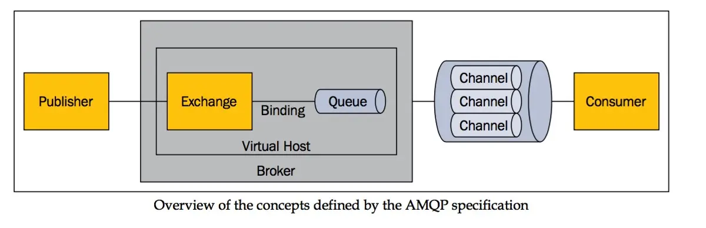

# AMQP & RabbitMQ

AMQP(Advanced Message Queuing Protocol高级消息队列协议)是一种链接协议。RabbitMQ是一个实现了AMQP的消息队列服务。

## AMQP

AMQ协议模型包含如下几个概念：

>- Producer(生产者)：向Exchange发布消息的客户端应用程序。
>- Consumer(消费者)：从Message Queue中请求消息的客户端应用程序。当多个消费者订阅同一个队列时，队列中的消息会被平均分摊（Round-Robin，即轮询）给多个消费者进行处理，而不是每个消费者都收到所有的消息并处理，这样避免消息被重复消费。
>- Exchange(交换机)：接收Producer发布的消息，并通过设定的路由规则将消息路由给绑定的Queue。
>- Binding(绑定器)：就是把Exchange和Queue按照路由规则绑定。
>- Broker(消息队列服务器实体\中间件）：Exchange和Queue所在服务器。
>- Vhost(虚拟主机)：用于用户的权限分离，类似于命名空间，一个Broker里可以开设多个vhost，一个vhost里可以创建多个交换机。
>- Channel(信道)：多路复用连接中的一条独立的双向数据流通道，为会话提供物理传输介质，在客户端的每个连接里，可建立多个通道。
>- Queue(消息队列)：消息的容器，用来保存消息直到被Consumer接收，每个消息都会被投入到一个或多个队列中。
>- Routing Key(路由键)：是生产者在发送消息时指定的关键字；它是消息的属性，它决定了消息将被传递给哪些队列。
>- Binding Key(绑定键)：是消费者在绑定队列时指定的关键字；它是队列的属性，用于将Exchange和队列绑定起来。
>- Message(消息)：本质上就是服务器与客户端传输的数据，由元信息和消息体组成，数据格式遵循AMQP协议。

Exchange交换机的四种类型：

>- Direct(直连)：将消息推送到binding key与该消息的routing key相同的队列。
>- Fanout(扇形):：一种广播方式，该交换机会把接收到的消息全部发送给绑定在自己身上的队列。使用该模式不需要routingKey。
>- Topic(主题)：将Routing Key与Binding Key进行匹配，Routing Key和Binding Key由多个单词组成，这些单词使用.分隔，使用*和#进行模糊匹配，*匹配一个单词，#匹配0个或多个单词。如果匹配成功，将消息发送到对应的Queue中。如a.error、b.error都和*.error匹配。
>- Headers(首部)：不依赖于Routing Key与Binding Key的匹配规则来路由消息，而是根据消息内容中的headers属性进行匹配。在绑定Exchange和Queue时指定一组键值对，当消息发送到Exchange时，会取得消息的headers，也是键值对的形式，将两组键值对进行匹配，如果完全匹配，则将消息发送到对应的Queue中。*headers 类型的 Exchange 性能会很差，不推荐使用。*

默认交换机（default exchange）实际上是一个由消息代理预先声明好的没有名字（名字为空字符串）的直连交换机（direct exchange）。它有一个特殊的属性使得它对于简单应用特别有用处：那就是每个新建队列（queue）都会自动绑定到默认交换机上，绑定的路由键（routing key）名称与队列名称相同。

## Message消息格式

Message消息包含元数据和消息体两部分， 消息体是消息实际传递的数据，元数据用于描述消息的一些特征信息。常用属性如下：

>- Content type： 内容类型。
>- Content encoding：内容编码。
>- Routing key ：路由键 。
>- Delivery mode： 消息持久化或非持久化。
>- Message priority ：消息优先权。
>- Message publishing timestamp： 消息发布的时间戳。
>- Expiration period： 消息有效期。
>- Publisher application id：发布应用Id。

## Exchange的常用属性

>- Name：交换机名称。
>- Type：交换机类型。
>- Durability：是否持久化，即当代理重启时是否保留该交换机，即交换机也可以是持久化和临时的。
>- Auto-delete：是否自动删除，即当交换机上没有绑定队列时是否自动删除该交换机。
>- Arguments：可选参数，插件和代理特定特性使用。

## Queue的常用属性

>- Name：队列名称。
>- Durable：是否持久化，消息代理重启后，是否保留队列。
>- Exclusive：只被一个连接（connection）使用，而且当连接关闭后队列即被删除。
>- Auto-delete：当最后一个消费者退订后即被删除。
>- Arguments：一些消息代理用他来完成类似与 TTL 的某些额外功能。

## 消息机制

消费者在处理消息时难免会遇到处理失败的情况，此时消息是否需要保留在队列中是AMQP中间件需要考虑的问题。AMQP提供了两种消息确认模式和拒绝消息模式来处理消费失败时消息的去处：

>- 自动确认模式：当消息中间件将消息发送给消费者后立即删除。
>- 显式确认模式：待消费者发送一个确认回执后再删除消息。
>- 拒绝消息：当一个消费者接收到某条消息后，处理过程有可能成功，有可能失败。当失败时消费者可以向消息中间件发送一个"拒绝消息"告知中间件如何处理这条消息——销毁它或者重新放入队列。

在多个消费者共享一个队列时，明确指定在收到下一个确认回执前每个消费者一次可以接受多少条消息是非常有用的。这可以在试图批量发布消息的时候起到简单的负载均衡和提高消息吞吐量的作用。
